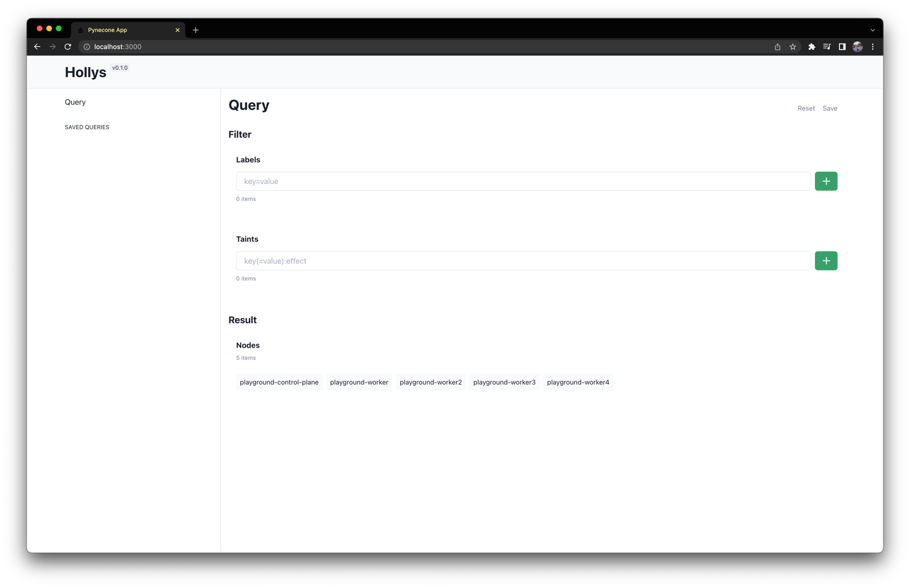
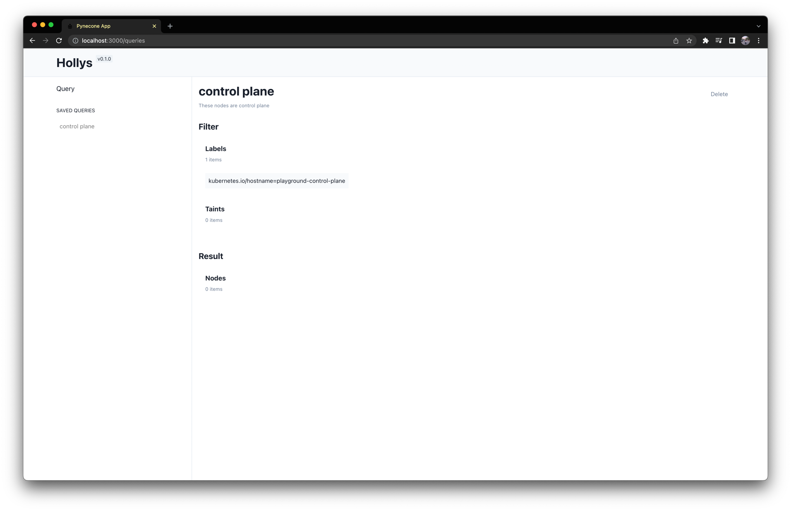

# Hollys

Web UI for node discovery in Kubernetes

## Motivation

There are too many nodes in the cluster. There are also too many labels and taints attached to each node.

How to easily find nodes with specific labels and taints? How can you share these discovered nodes with other members of your team?

I started developing Hollys to solve this problem.

## Features

- You can retrieve a list of nodes based on labels and taints.
- You can save the list of nodes searched in this way.





## Installation

```bash
$ git clone git@github.com:heumsi/hollys.git
$ cd chart
$ helm install hollys . --set ingress.host.ui="YOUR_UI_DOMAIN" --set ingress.host.api="YOUR_API_DOMAIN"
```
